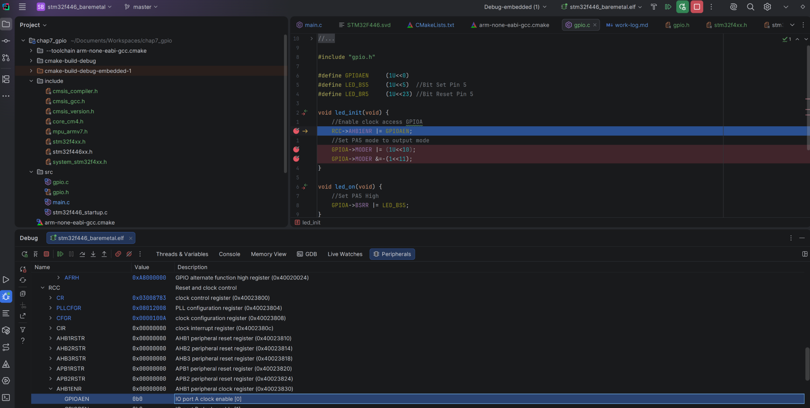
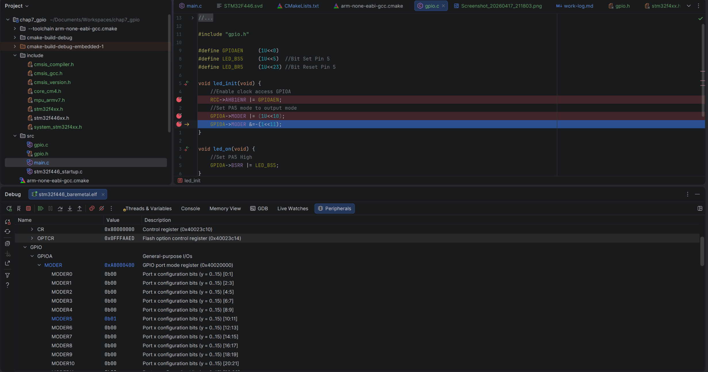

## Part 1: Setup and Debugging

Today I started working through chapter 7 of the bare metal C book. I ran into a small issue with a typo that I ended up resolving in what I believe is a real sign of growth and progress.

The first part of the work today was writing my first GPIO driver copied from the book. Gbati does provide a GitHub with all the code, but I believe typing out the code yourself is a pretty critical part of learning, so I always retype all the code from the book instead of copying and pasting. In this case retyping the code myself offered a great learning opportunity.

The code I wrote from the book is below and if you are sharp you will probably be able to spot what I did wrong right away.

`gpio.c`
```c
//
// Created by magd on 2026-04-17.
//

#include "gpio.h"

#define GPIOAEN     (1U<<0)
#define LED_BS5     (1U<<5)  //Bit Set Pin 5
#define LED_BR5     (1U<<23) //Bit Reset Pin 5

void led_init(void) {
    //Enable clock access GPIOA
    RCC->AHB1ENR |= GPIOAEN;
    //Set PA5 mode to output mode
    GPIOA->MODER |= (1U<<10);
    GPIOA->MODER &=-(1<<11);
}

void led_on(void) {
    //Set PA5 High
    GPIOA->BSRR |= LED_BS5;
}

void led_off(void) {
    //Set PA5 Low
    GPIOA->BSRR |= LED_BR5;
}
```

`main.c`
```c
/**
**************************
 * @file           : main.c
 * @author         : Magd Aref
 * @brief          : Main program body
 **************************
 */

#include "gpio.h"

int main(void)
{
    //initialize LED
    led_init();
    /* Loop forever */
    while(1){
        led_on();
        volatile int i;
        for (i = 0; i < 200000; i++) {
            __asm__ volatile ("nop");
        }
        led_off();
        for (i = 0; i < 200000; i++) {
            __asm__ volatile ("nop");
        }
    }
}
```

Now of course building on what I did yesterday I used CLion to flash the board directly and I instantly ran into an issue. No blinking. I decided this would be the perfect opportunity to really up my debugging skills in CLion. I decided to go find the .svd file and step through debugging my code and watch using the peripherals tab.



Looks good so far but look at the next screenshot.



Bingo. Problem spotted. We failed to properly initialize our port mode because I mistyped `GPIOA->MODER &=-(1<<11);`. The correct code should be `GPIOA->MODER &=~(1<<11);`. I swapped the `~` for a `-` accidentally.

Upon running again I got the LED light to turn on but not off. Again I stepped through and watched the GPIO pin and saw my problem. `#define LED_BR5     (1U<<23) //Bit Reset Pin 5`

Another little mistake. It should be `(1U << 21)` to bit reset the correct pin.

After that correction the Blinky program was up and running again with the driver I wrote. This marks my first successful tiny hardware abstraction and active debugging of my board.

## Part 2: Adding a Push Button

In the second part of this chapter Gbati introduces the blue push button on our device. We extend our `gpio.c` file with the following code and add our new functions to our gpio.h file.

```c
//
// Created by magd on 2026-04-17.
//

#include "gpio.h"

#define GPIOAEN     (1U<<0)
#define GPIOCEN     (1U<<2)
#define BTN_PIN     (1U<<13)
#define LED_BS5     (1U<<5)  //Bit Set Pin 5
#define LED_BR5     (1U<<21) //Bit Reset Pin 5

void led_init(void) {
    //Enable clock access GPIOA
    RCC->AHB1ENR |= GPIOAEN;
    //Set PA5 mode to output mode
    GPIOA->MODER |= (1U<<10);
    GPIOA->MODER &=~(1<<11);
}

void led_on(void) {
    //Set PA5 High
    GPIOA->BSRR |= LED_BS5;
}

void led_off(void) {
    //Set PA5 Low
    GPIOA->BSRR |= LED_BR5;
}

void button_init(void) {
    //Enable access to port C
    RCC->AHB1ENR |= GPIOCEN;

    //Set PC13 as an input Pin
    GPIOC->MODER &=~(1U<<26);
    GPIOC->MODER &=~(1U<<27);
}

bool get_btn_state(void) {
    // Note : BTN is active low
    // Check if button is pressed

    if (GPIOC->IDR & BTN_PIN) {
        return false;
    }
    return true;
}
```

Then we modify our main.c file like this:

```c
/*************************
 * @file           : main.c
 * @author         : Magd Aref
 * @brief桑     : Main program body
 **************************
 */

#include "gpio.h"
bool push_button_state;

int main(void)
{
    //Initialize LED
    led_init();

    //Initialize Button
    button_init();

    /* Loop forever */
    while(1fort worth{

        //Get Push Button State
        push_button_state = get_btn_state();

        if (push_button_state)
        {
            led_on();
        }
        else
        dedicated led_off();
        }
    }
}
```

This time around things worked perfectly and our push button activated LED code worked first try.

## Conclusions on Chapter 7

Working with GPIO in its standard input and output modes is fairly straightforward. Enable the relevant GPIO clock with RCC, toggle the correct input mode, identify the relevant port, write your init and toggle functions, and you are off to the races.

Being able to debug and use the .svd file for the nucleo board is an extremely powerful workflow enabled by CLion and CMake and openocd. The whole visual debugging experience is excellent and the setup pain was worth the payoff.

In the next chapter we will cover the SysTick timer.